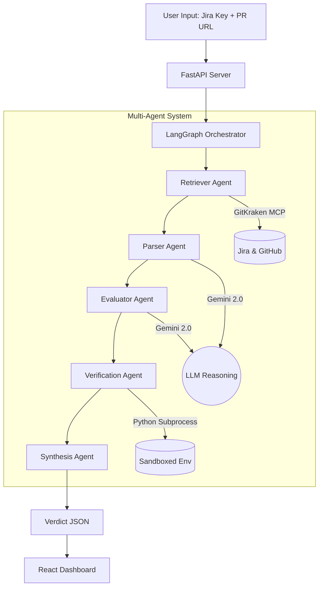

# System Architecture

The Jira Ticket Evaluator utilizes a multi-agent orchestration pattern to ensure precise and traceable code reviews.

## Agent Workflows

### 1. Context Retrieval
The **Retriever Agent** interacts with the **GitKraken MCP** to fetch the primary sources of truth: the Jira ticket content and the GitHub PR metadata/diff.

### 2. Requirement Parsing
The **Parser Agent** uses zero-shot prompting with **Gemini 2.0 Flash** to decompose unstructured Jira descriptions into atomic, testable requirements.

### 3. reasoning & Evaluation
The **Evaluator Agent** performs a line-by-line comparison of the PR diff against the requirements. It maps specific code changes to acceptance criteria and assigns a status (Pass/Partial/Fail).

### 4. Dynamic Verification
The **Verification Agent** provides an additional layer of certainty by generating and executing unit tests for failed requirements, ensuring the agent's skepticism is backed by empirical data.

### 5. Final Synthesis
The **Synthesis Agent** aggregates all evidence, calculates a confidence score, and produces the final verdict payload.
