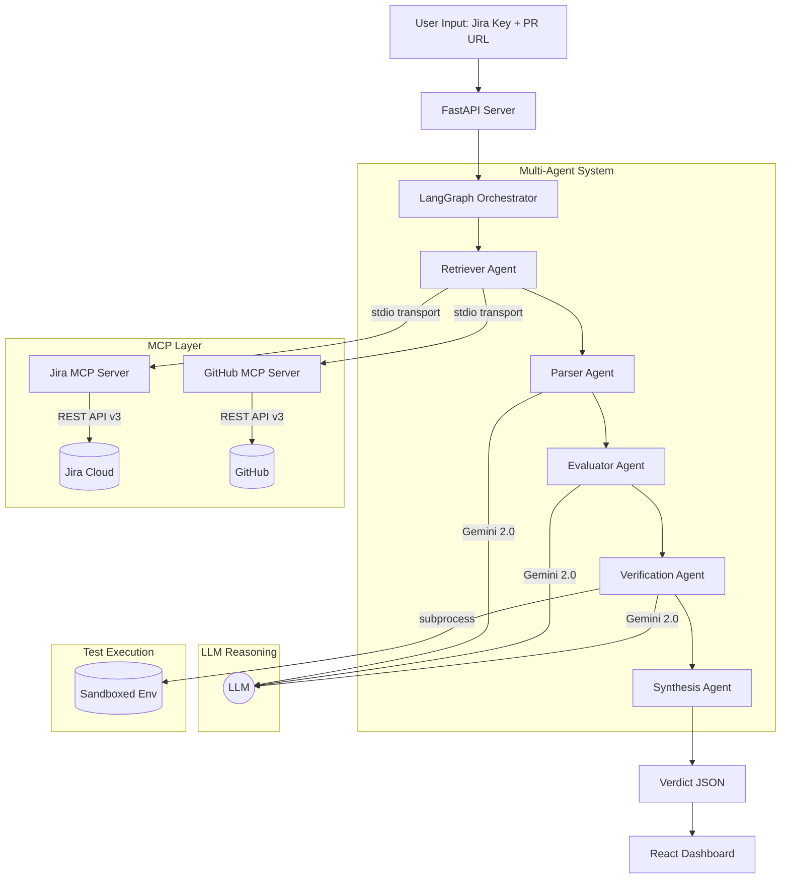

# System Architecture

The Jira Ticket Evaluator utilizes a multi-agent orchestration pattern to ensure precise and traceable code reviews.

## MCP Integration

The system uses two **custom MCP servers** to provide tool-use capability to the Retriever Agent:

### Jira MCP Server (`src/mcp_servers/jira_server.py`)
| Tool | Description |
|:-----|:------------|
| `get_jira_ticket` | Fetches ticket summary, description (with ADF parsing), status, priority, labels |
| `get_jira_ticket_comments` | Retrieves all comments for additional context |
| `search_jira_tickets` | JQL-based search for related tickets |

### GitHub MCP Server (`src/mcp_servers/github_server.py`)
| Tool | Description |
|:-----|:------------|
| `get_pull_request` | PR metadata: title, body, state, author, branches, stats |
| `get_pull_request_diff` | Full unified diff (truncated at 50K chars for LLM context) |
| `get_pull_request_files` | Changed files with per-file patches, additions, deletions |
| `get_pull_request_reviews` | Code review comments and approval status |
| `get_file_content` | Full file content at any branch/commit ref |

Both servers use **stdio transport** and are spawned as subprocesses by the MCP client (`src/mcp_client.py`).

## Agent Workflows

### 1. Context Retrieval
The **Retriever Agent** uses the MCP client to connect to both MCP servers and fetch data. It follows a 3-tier fallback strategy:
1. **MCP servers** (preferred — demonstrates MCP tool-use)
2. **Direct REST API** (fallback if MCP transport fails)
3. **Mock data** (development/demo when no credentials are configured)

### 2. Requirement Parsing
The **Parser Agent** uses zero-shot prompting with **Gemini 2.0 Flash** to decompose unstructured Jira descriptions into atomic, testable requirements.

### 3. Reasoning & Evaluation
The **Evaluator Agent** performs a multi-step analysis of the PR diff against requirements. For each requirement, it produces:
- A verdict (Pass/Partial/Fail)
- Detailed reasoning
- Structured evidence with file paths, line numbers, and code snippets
- Populates the **traceability map** for line-level code-to-requirement mapping

### 4. Dynamic Verification
The **Verification Agent** generates Python test scripts for failed/partial requirements using Gemini, then **executes them** via subprocess. Test results (stdout, stderr, return code) are captured and included in the final report.

### 5. Final Synthesis
The **Synthesis Agent** aggregates all evidence and calculates a **data-driven confidence score** based on three dimensions:
- **Verdict clarity** (40%): Decisive Pass/Fail vs ambiguous Partial/Unknown
- **Evidence quality** (30%): Presence of specific file + line evidence in traceability map
- **Test corroboration** (30%): Whether executed tests align with the agent's assessment
